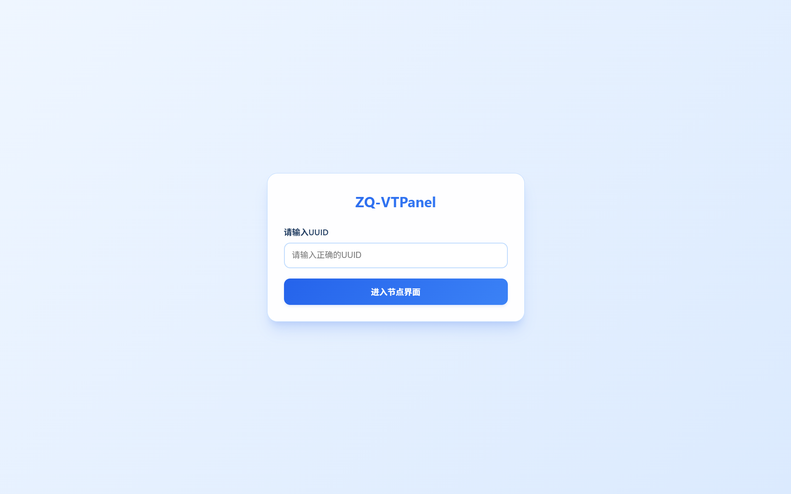
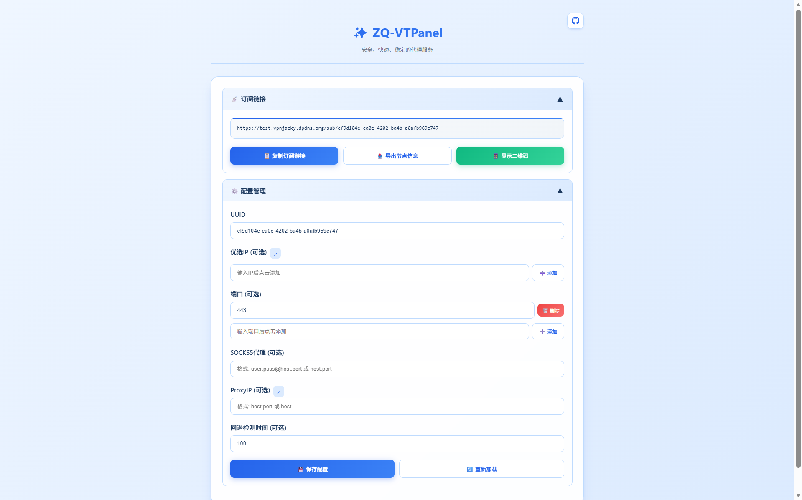

# ZQ-VTPanel

## ✨ 功能特点

- 🚀 **多出站支持**：直连、SOCKS5代理、ProxyIP自动切换
- 🎛️ **Web配置管理**：通过Web界面管理所有配置，无需修改代码
- 🔒 **安全验证**：UUID验证确保只有授权用户能访问
- 📱 **响应式设计**：支持桌面和移动端访问
- 🎨 **优选工具集成**：内置优选域名,ProxyIP与订阅链接转换工具链接
- ⚡ **高性能**：基于Cloudflare Workers，全球加速
- 🔄 **双协议支持**：同时支持VLESS和Trojan协议，兼容性强
- 🛡️ **流量混淆**：参数和路径伪装，降低被检测风险
- ✂️ **代码优化**：精简至约500行，保持所有功能

## 🚀 部署步骤

### 1. 部署到Workers

1. 登录 Cloudflare 控制台
2. 左侧进入 **Workers 和 Pages**
3. 点击 **创建应用程序** → 选择 **创建 Worker**
4. 输入 Worker 名称并创建
5. 进入在线编辑器：
   - 删除默认模板代码
   - 打开本仓库的 `_worker.js`，复制全部内容
   - 粘贴到 Cloudflare 在线编辑器中
6. 点击右上角 **保存并部署**
7. 创建 KV 命名空间：
   - 左侧进入 **存储和数据库**，点击**KV**
   - 点击 **创建命名空间**，名称建议：`VTPanel`
8. 在 Worker 详情页绑定 KV：
   - 打开 Worker → **设置** → **变量** → **KV 命名空间绑定** → **添加绑定**
   - 变量名称：`VTPanel`
   - 选择刚创建的 KV 命名空间
   - 点击 **保存**
9. 修改兼容日期为2026-02-24
10. 绑定自定义域名(`注意:不能使用workers默认域名`)

### 2. 部署到Pages
1. [下载 ZIP](https://github.com/bayueqi/ZQ-VTPanel/archive/refs/heads/main.zip)
2. 登录 Cloudflare → **Workers 和 Pages** → **创建应用程序** → 选择 **创建 Pages**
3. 选择 **直接上传**，上传下载的 ZIP 包,直接保存并部署
4. 创建 KV 命名空间：
   - 左侧进入 **存储和数据库**，点击**KV**
   - 点击 **创建命名空间**，名称建议：`VTPanel`
5. 绑定 KV：进入 Pages 项目 → **设置** → **变量** → **KV 命名空间绑定** → **添加绑定**
   - 变量名称：`VTPanel`
   - 选择已创建的 KV 命名空间
6. 修改兼容日期为2026-02-24
7. 再次上传 ZIP 包并部署，接着访问域名(`可以绑定自定义域名，也可使用pages默认域名`)

## 📖 使用说明

### 首次使用

1. 访问你的项目域名
2. 输入`ef9d104e-ca0e-4202-ba4b-a0afb969c747`进入节点界面
3. 点击右上角 **⚙️** 按钮进入配置管理
4. 配置你的代理设置：
   - **UUID**：强烈建议修改，用于身份验证
   - **优选ip**：可选，默认worker域名
   - **端口**：可选，默认443(可填443系端口:443、2053、2083、2087、2096、8443)
   - **SOCKS5代理**：可选，格式 `user:pass@host:port`或者`host:port`
   - **ProxyIP**：可选，格式 `host:port`或者`host`
   - **回退检测时间**：可选，默认100毫秒，当连接无响应时等待的时间，单位毫秒，范围1-5000

## 🔗 连接方式说明

### 连接模式特点与优势

| 连接模式 | 特点 | 
|---------|------|
| **直连** | 直接使用Cloudflare Workers IP |
| **SOCKS5** | 严格使用SOCKS5代理，不回退 |
| **直连+SOCKS5** | 直连失败时使用SOCKS5 |
| **直连+ProxyIP** | 直连失败时使用ProxyIP | 
| **直连+SOCKS5+ProxyIP** | 直连失败时使用SOCKS5，最后使用ProxyIP | 

## 💡 设计巧思：为什么不融合所有模式？

不同于其他项目将直连、SOCKS5、ProxyIP混在一起的做法，本项目提供了多种独立选择，这是基于以下考虑：

1. **访问限制差异**
   - 直连模式：无法访问Cloudflare基础网站，但延迟最低
   - SOCKS5中转：隐私保护能力不足，可能暴露真实信息
   - ProxyIP：仅能访问非Cloudflare基础网站

2. **隐私安全考量**
   - 如果将所有模式融合在一起，SOCKS5代理可能成为隐私泄露的短板
   - 独立选择模式可以确保用户清楚知道当前使用的连接方式

3. **用户体验平衡**
   - 虽然直连+ProxyIP理论上可以解决访问问题，但模式切换会产生延迟
   - 频繁的自动切换反而影响整体使用体验

4. **灵活定制方案**
   - 提供多种组合让用户根据自身网络环境和需求选择
   - 加入回退检测时间参数（1-5000毫秒可调），用户可以自行权衡速度与可靠性

这种设计既保证了隐私安全，又提供了充分的灵活性，让用户能够找到最适合自己的连接方案。

## 🛡️ 流量混淆特性

本项目通过以下方式增强流量混淆，降低被检测和针对的风险：

- **路径伪装**：WebSocket路径伪装为正常API风格（如 `/api/v1/data`）
- **参数混淆**：使用简短无意义的参数名（`t`, `d`, `s`, `p`）替代明显的代理参数
- **随机参数**：每个节点都添加随机的 `v` 参数增加流量多样性
- **订阅兼容**：使用标准的Base64编码确保订阅功能正常

## 🤝 贡献

欢迎提交Issue和Pull Request！
