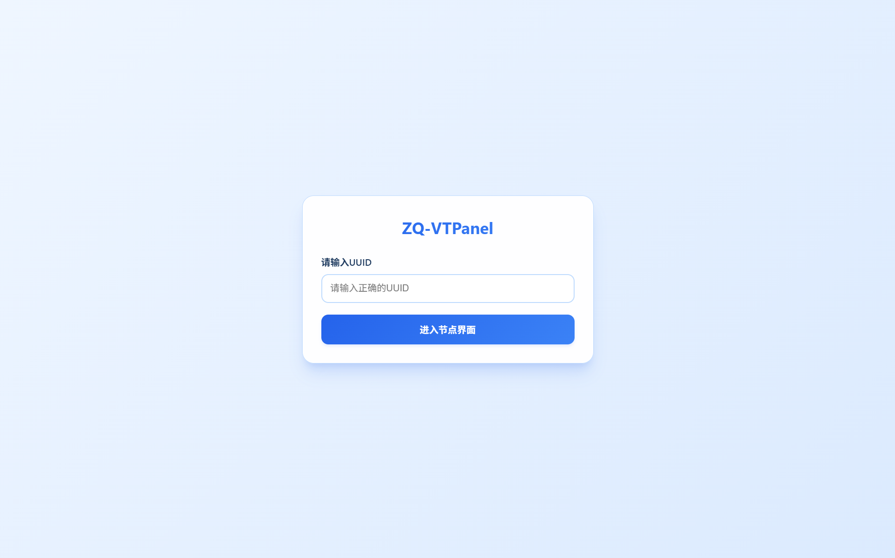
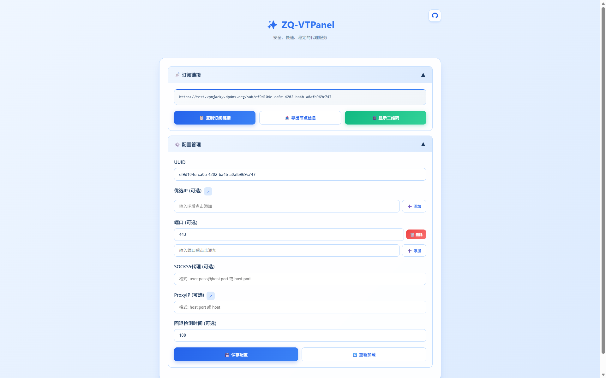

# ZQ-VTPanel

## ✨ 功能特点

- 🚀 **灵活节点类型选择**：5种连接方式可选（直连、其它代理、直连+其它代理、直连+ProxyIP、直连+其它代理+ProxyIP），按需勾选
- 📋 **协议类型自由切换**：VLESS / Trojan 协议独立勾选，可单独或同时生成
- 🔗 **智能解锁机制**：其它代理 / ProxyIP 类型需填写对应配置才能启用，避免生成无效节点
- 🌐 **其它代理支持多种协议**：`socks5` / `http` / `https` / `sstp` / `turn`，填带协议前缀的完整地址即可，不写前缀按 `socks5` 处理
- 🎛️ **Web配置管理**：通过Web界面管理所有配置，可折叠区域 + 内部滚动，操作流畅
- 🔒 **安全验证**：UUID验证确保只有授权用户能访问
- 📱 **响应式设计**：桌面与移动端自适应，手机上面板取消配置区内部滚动、按钮与输入框自动收紧排布
- 🎨 **优选工具集成**：内置优选域名,ProxyIP与订阅链接转换工具链接
- 🔀 **订阅转换服务可自建**：Clash / Sing-Box / Surge 订阅交由 Sublink Worker 转换，转换服务地址可在面板里直接修改
- ⚡ **高性能**：基于Cloudflare Workers，全球加速
- 🛡️ **流量混淆**：参数和路径伪装，降低被检测风险
- 🔧 **自动优选IP**：支持配置优选IP API，手动或定时自动获取更新优选IP

## 🚀 部署步骤

### 1. 部署到Workers

1. 登录 Cloudflare 控制台
2. 左侧进入 **Workers 和 Pages**
3. 点击 **创建应用程序** → 选择 **创建 Worker**
4. 输入 Worker 名称并创建
5. 进入在线编辑器：
   - 删除默认模板代码
   - 打开本仓库的 `_worker.js`，复制全部内容
   - 粘贴到 Cloudflare 在线编辑器中
6. 点击右上角 **保存并部署**
7. 创建 KV 命名空间：
   - 左侧进入 **存储和数据库**，点击**KV**
   - 点击 **创建命名空间**，名称建议：`VTPanel`
8. 在 Worker 详情页绑定 KV：
   - 打开 Worker → **设置** → **变量** → **KV 命名空间绑定** → **添加绑定**
   - 变量名称：`VTPanel`
   - 选择刚创建的 KV 命名空间
   - 点击 **保存**
9. 绑定自定义域名(`注意:不能使用workers默认域名`)

### 2. 部署到Pages
1. [下载 ZIP](https://github.com/bayueqi/ZQ-VTPanel/archive/refs/heads/main.zip)
2. 登录 Cloudflare → **Workers 和 Pages** → **创建应用程序** → 选择 **创建 Pages**
3. 选择 **直接上传**，上传下载的 ZIP 包,直接保存并部署
4. 创建 KV 命名空间：
   - 左侧进入 **存储和数据库**，点击**KV**
   - 点击 **创建命名空间**，名称建议：`VTPanel`
5. 绑定 KV：进入 Pages 项目 → **设置** → **变量** → **KV 命名空间绑定** → **添加绑定**
   - 变量名称：`VTPanel`
   - 选择已创建的 KV 命名空间
6. 再次上传 ZIP 包并部署，接着访问域名(`可以绑定自定义域名，也可使用pages默认域名`)

## 📖 使用说明

### 首次使用

1. 访问你的项目域名
2. 输入`ef9d104e-ca0e-4202-ba4b-a0afb969c747`进入节点界面
3. 点击"⚙️配置管理"展开配置区域，按需填写：
   - **UUID**：强烈建议修改，用于身份验证
   - **优选IP域名**：默认worker域名
   - **端口**：可选，默认443(可填443系端口:443、2053、2083、2087、2096、8443)
   - **ProxyIP**：可选，格式 `host:port` 或者 `host`
   - **其它代理**：可选，格式 `[协议://]user:pass@host:port` 或 `host:port`，协议支持 `socks5` / `http` / `https` / `sstp` / `turn`，不写协议前缀按 `socks5` 处理
   - **订阅转换服务**：可选，填你自建的 Sublink Worker 根地址（如 `https://sublink.example.com`）
   - **回退检测时间**：可选，默认200毫秒，当连接无响应时等待的时间，单位毫秒，范围1-5000
4. **节点类型选择**（至少选一个）：
   - **直连**：直接使用 Cloudflare Workers IP，始终可选
   - **其它代理**：严格走其它代理，不做直连回退（需先填写其它代理字段）
   - **直连+其它代理**：直连失败回退其它代理（需先填写其它代理字段）
   - **直连+ProxyIP**：直连失败回退 ProxyIP（需先填写 ProxyIP 字段）
   - **直连+其它代理+ProxyIP**：直连→其它代理→ProxyIP 逐级回退（需两者都填）
   - 💡 提示：填入其它代理或 ProxyIP 后，对应的节点类型会自动**解锁可勾选**
5. **协议类型选择**（至少选一个）：
   - **VLESS**：Xray 原生协议，性能优秀，推荐使用
   - **Trojan**：简洁高效，伪装性强，兼容性好
6. 配置自动优选IP（可选）：
   - 点击"自动优选"按钮展开设置
   - **优选IP API地址**：默认 `https://ipdb.api.030101.xyz/?type=bestcf`
   - **自动获取优选IP**：勾选后可通过 Cron 定时任务自动更新
   - 点击"🔄获取优选IP"可手动立即获取
   - 在 Cloudflare Workers 后台 → Triggers → Cron Triggers
   - 添加定时任务（例如 `0 */6 * * *` 每6小时执行一次）
7. **配置 ECH（可选）**：
   - 点击 ECH 区域的"高级"按钮展开设置
   - 勾选"启用 ECH"
   - **ECH 解析域名 (SNI)**：默认 `cloudflare-ech.com`，即 ECH 公钥查询所用的服务器名称
   - **ECH DNS 服务 (DoH)**：默认 `https://sm2.doh.pub/dns-query`，用于解析 ECH 配置的 DNS over HTTPS 地址
   - 启用后，订阅会自动注入 ECH 参数，让被 DNS 污染的节点域名也能正常连接
8. 点击"💾保存配置"，订阅内容会根据你的选择实时刷新

## 🔗 连接方式说明

### 连接模式特点与优势

| 节点类型 | 特点 | 解锁条件 |
|---------|------|---------|
| **直连** | 直接使用 Cloudflare Workers IP，延迟最低 | 始终可用 |
| **其它代理** | 严格走其它代理，不回退 | 需填写其它代理 |
| **直连+其它代理** | 直连失败时回退其它代理 | 需填写其它代理 |
| **直连+ProxyIP** | 直连失败时回退 ProxyIP | 需填写 ProxyIP |
| **直连+其它代理+ProxyIP** | 直连→其它代理→ProxyIP 逐级回退 | 需同时填写其它代理和 ProxyIP |

> 💡 **节点备注**：订阅里的节点备注会带上实际使用的代理协议名（`SOCKS5` / `HTTP` / `HTTPS` / `SSTP` / `TURN`），三种含代理的节点类型分别显示为 `协议名`、`直连+协议名`、`直连+协议名+ProxyIP`。

> 💡 **节点数量公式**：生成的节点总数 = 域名数 × 端口数 × 勾选的节点类型数 × 勾选的协议数 

## 💡 设计巧思：为什么不融合所有模式？

不同于其他项目将直连、其它代理、ProxyIP混在一起的做法，本项目提供了多种独立选择，这是基于以下考虑：

1. **访问限制差异**
   - 直连模式：无法访问Cloudflare基础网站，但延迟最低
   - 其它代理中转：隐私保护能力取决于你填的代理，可能暴露真实信息
   - ProxyIP：仅能访问非Cloudflare基础网站

2. **隐私安全考量**
   - 如果将所有模式融合在一起，其它代理可能成为隐私泄露的短板
   - 独立选择模式可以确保用户清楚知道当前使用的连接方式

3. **用户体验平衡**
   - 虽然直连+ProxyIP理论上可以解决访问问题，但模式切换会产生延迟
   - 频繁的自动切换反而影响整体使用体验

4. **灵活定制方案**
   - 提供多种组合让用户根据自身网络环境和需求选择
   - 加入回退检测时间参数（1-5000毫秒可调），用户可以自行权衡速度与可靠性

这种设计既保证了隐私安全，又提供了充分的灵活性，让用户能够找到最适合自己的连接方案。

## 🛡️ 流量混淆特性

本项目通过以下方式增强流量混淆，降低被检测和针对的风险：

- **路径伪装**：WebSocket路径伪装为正常API风格（如 `/api/v1/data`）
- **参数混淆**：使用简短无意义的参数名（`t`, `d`, `s`, `p`）替代明显的代理参数
- **随机参数**：每个节点都添加随机的 `v` 参数增加流量多样性
- **订阅兼容**：使用标准的Base64编码确保订阅功能正常

## 🤝 贡献

欢迎提交Issue和Pull Request！
